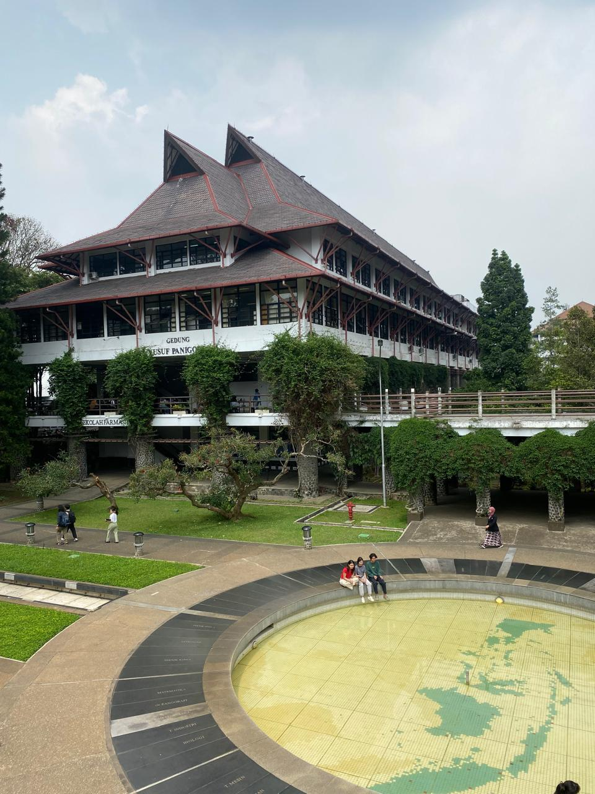
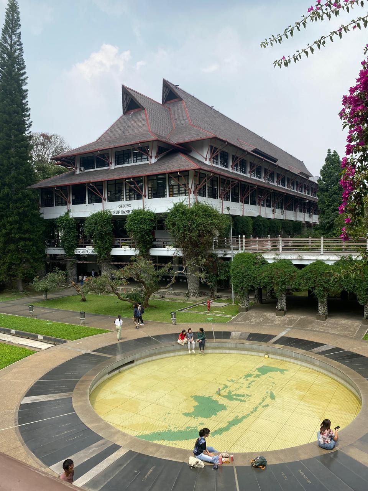

# Dekomposisi Masalah

Pada masalah ini, pengguna tidak dapat mengetahui lokasinya,
pengguna mengestimasi posisi dan orientasi menggunakan kamera.
Dengan gambar, pengguna dapat mengetahui posisi dan orientasi
kameranya.

## Masalah

1. Lokasi tidak diketahui, asumsi lokasi memiliki fitur visual yang cukup
2. Perlu mengetahui Posisi dan orientasi kamera berdasar gambar

Pada gambar, posisi dan orientasi kamera dapat diketahui menggunakan
beragam metode, misalnya dengan epipolar geometry, triangulasi, dan PnP.
Ketiga metode tersebut dapat menjadi building block untuk membangun
metode yang lebih canggih yaitu visual odometry atau visual SLAM.

## Solusi

Pada implementasi ini, saya mengimplementasikan building block dari
visual odometry sederhana yaitu estimasi camera motion dengan epipolar
geometry dan essential matrix. Dengan solusi ini, masalah dapat didekomposis menjadi:

### Ekstraksi dan penyocokan fitur, Perolehan koordinat 2d fitur pada gambar

Algoritma ekstraksi fitur yang dipilih adalah Oriented FAST karena algoritma ini
dapat memberikan akurasi yang baik dengan performa yang masih dapat dipakai untuk
aplikasi realtime. Setelah fitur terekstraksi, diambil descriptor dari masing-masing
fitur dengan menggunakan BRIEF. Descriptor tersebut digunakan untuk penyocokan fitur
menggunakan Hamming-BruteForce. Setelah didapat fitur yang cocok, diambil fitur inlier
yang memiliki hamming distance kecil.

Implementasi dapat dilihat di [Feature](../src/feature_method.cpp)
Pada implementasi tersebut saya menggunakan method yang teredia di opencv

### Gerak Kamera, Perolehan koordinat 3d gerak kamera berdasarkan gambar

$$
\mathbf{p}_{2}^{T}\mathbf{K}^{-T}\mathbf{t}^{^}\mathbf{RK}^{-1}\mathbf{p}_1 = 0
$$

Dengan menggunakan fitur yang telah diekstraksi dan dicocokan, gerak kamera dapat
ditentukan dengan memanfaatkan epipolar geometry. Epipolar constraint dapat
memberikan translasi dan rotasi kamera dengan fundamental Matrix $F$ dan essential
matrix $E$.

$$
\mathbf{E} = \mathbf{t}^\mathbf{R} \\
\mathbf{F} = \mathbf{K}^{-T}\mathbf{EK}^{-1} \\
\mathbf{x_}2^T\mathbfE\mathbf{x}_1 = \mathbf{p}_2^T\mathbf{F}\mathbf{p}_1=0 \\
$$

Dengan menggunakan dekomposisi $\mathbf{E}$, diperoleh matrix rotasi $\mathbf{R}$ dan vektor translasi $\mathbf{t}%

Implementasi dapat dilihat di [Feature](../src/camera_motion.cpp)
Pada implementasi tersebut saya menggunakan method yang teredia di opencv

Kelemahan dari metode ini adalah up to a scale, yang mana besaran pada matrix yang dihasilkan
tidak memiliki skala. Hal ini merupakan keterbatasan informasi yaitu hanya terdapat gambar
dengan perspektif berbeda dari satu kamera. Ini dapat diatasi dengan menggunakan informasi lain seperti
akselerasi dan orientasi dari IMU atau menggunakan kamera stereo sehingga depth dengan metric scale dapat diambil.

### Hasil, galat, dan keterbatasan solusi

dengan menggunakan gambar sample  dan  didapat hasil
posisi dan orientasi kamera dalam homogeneous matrix

```
Camera pose:
  0.999237 -0.0370057  -0.012498   0.393598
 0.0371642   0.999228  0.0126983   0.365572
 0.0120184 -0.0131531   0.999841  -0.843467
         0          0          0          1
```

Translasi yang dihasilkan dinormalisasi sehingga normnya berukuran 1.
Hal ini merupakan keterbatasan solusi dan informasi karena menggunakan
kamera monokular dan tidak ada informasi lain selain fitur seperti
informasi dari IMU.
